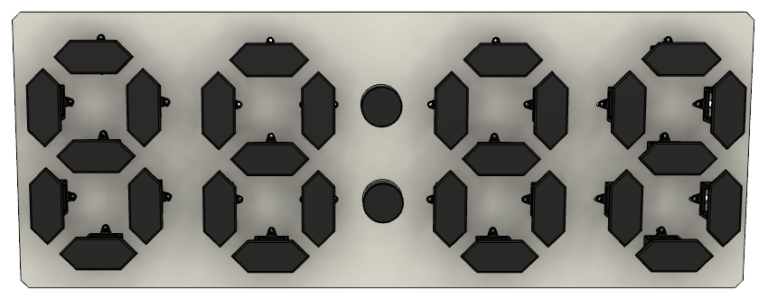
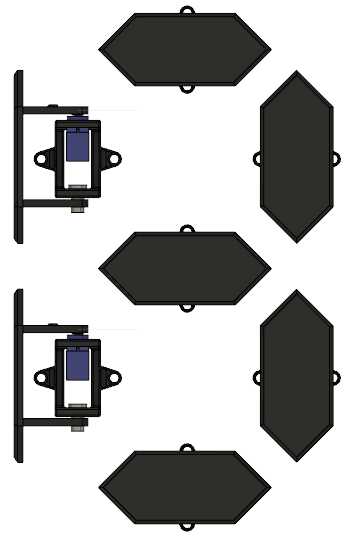

# 7-Segment-Display-Clock

The inspiration for this project originates from the 7-segment displays used in household appliances, but instead of using a digital display, I wanted to utilize servo motors. The motors are able to rotate the front by 90 degrees, which enables it to display both numbers and various characters. 

  

By combining four of these segments, it can display time. However, it is also capable of displaying temperature and humidity.  The data is gathered in real-time using a [weather API](https://openweathermap.org/api)

To switch between time, temperature, and humidity, the microcontroller hosts a local web application

